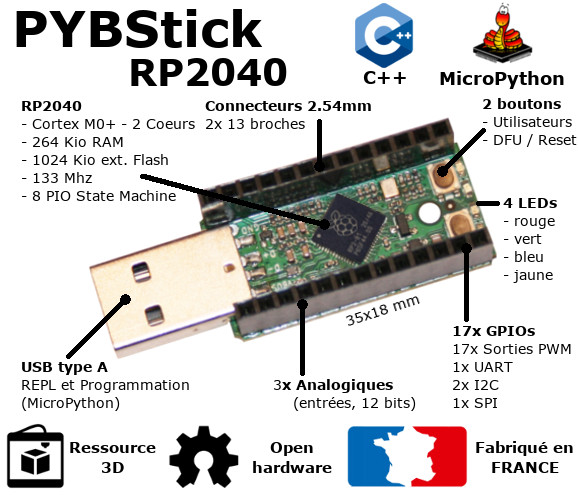
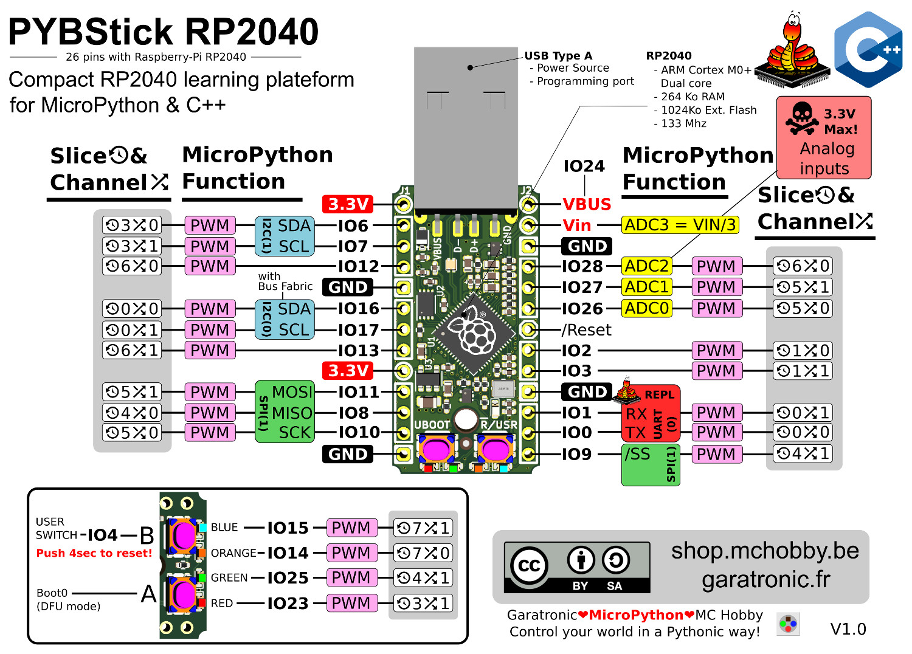
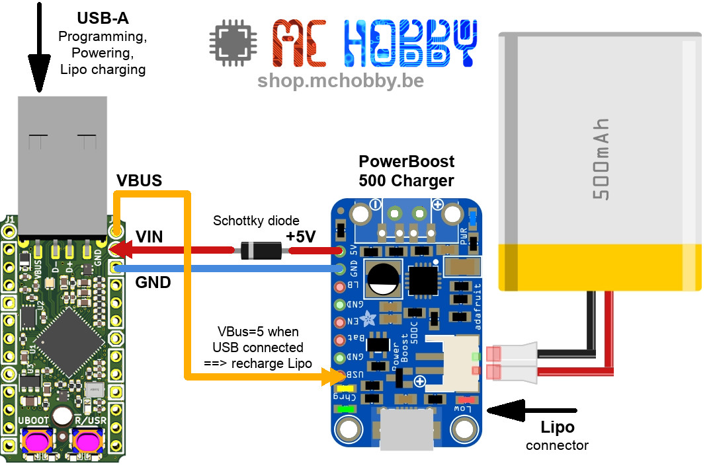

# PYBStick-RP2040 : La carte MicroPython compacte basé sur le RP2040

__UNDER WRITING - WILL BE TRANSLATED LATER__

Les cartes PYBStick sont issues d'un projet démarré par Garatronic et MCHobby
pour rendre l'accès à la programmation MicroPython et Arduino plus abordable,
pratique et documenté en Français.

Si la [PYBStick standard est basée sur le puissant STM32](https://github.com/mchobby/pyboard-driver/tree/master/PYBStick), ce modèle ci est
basé sur le puissance microcontrôleur double coeur de la fondation Raspberry-pi : le [RP2040](https://shop.mchobby.be/fr/ic-cms/2146-microcontroleur-raspberry-pi-rp2040-double-coeur-cortex-m0-133mhz-3232100021464.html).

Le RP2040 est ce même microcontrôleur qui équipe le désormais célèbre [Raspberry-Pi Pico](https://shop.mchobby.be/fr/pico-rp2040/2036-pico-header-rp2040-microcontroleur-2-coeurs-raspberry-pi-3232100020368.html)
qui supporte MicroPython et d'autres environnements de développement... que demander de plus?

Toujours avec le même facteur de forme, la PYBStick-RP2040 reste très compacte et abordable.

# PYBStick RP2040

La version PYBStick RP2040 26 est équipée d'un RP2040 cadencé à 133 MHz.
Il s'agit d'un double coeur cortex M0+, processeur 32 bits ARM.

[Fiche technique du RP2040](https://datasheets.raspberrypi.com/rp2040/rp2040-datasheet.pdf) (pdf).

# Alimentation

Le plus simple pour alimenter votre PYBStick est d'utiliser le connecteur USB.

D'autres options d'alimentation sont possibles et s’avéreront utile pour les projets énergivores (ex: plateformes motorisées).

## Alimenté par USB: (le plus facile)
* La broche VBUS est à 5.00V à 5.25V (tension standard USB).
* La broche VIN est à 4.85V (à cause de la chute de tension dans la diode Schottky B5817WS)
* La broche 3.3V produit une tension de 3.3V (300 mA) par l'intermédiaire du régulateur de tension ME6215C33. --- A VERIFIER

Dans cette configuration, il est également possible de brancher une source d'alimentation externe sur VIN. La courant de cette alimentation externe sera bloqué par la diode Schottky et ne pourra donc pas se déverser dans la connexion USB.

Si vous comptez brancher une alimentation externe sur VIN et connecter la PYBStick en USB en même temps alors il sera nécessaire de placer une diode en série avec alimentation externe (pour empêcher VBUS de déverser un courant dans l'alimentation externe).

## Alimenté par VIN: (18V max) --- A VERIFIER

* La broche VIN peut recevoir une alimentation externe (18V max). Si le connecteur USB est succeptible d'être branché en même temps, il faut prévoir une diode Schottky (voir point précédent).
* La broche VBUS est à 0V (si la plateforme n'est pas connectée sur une source USB).
* La broche 3.3V produit une tension de 3.3V par l'intermédiaire du régulateur de tension 3.3V.

## Alimenté par 3.3V:

Non recommandé et réservé à un public averti!

Il est possible de brancher une source d'alimentation derrière le régulateur de tension (donc sur la broche 3.3V). Dans ce cas, vous ne pouvez plus alimenter la carte via VIN ou USB (VBUS).

Toute erreur de tension ou de polarisation sur cette broche entraînera la destruction immédiate de la carte.

## Alimentation LiPo:

La PYBStick ne dispose pas d'un contrôleur LiPo mais il est tout à fait possible d'ajouter un ACCU Lipo sur votre PYBStick à l'aide d'un PowerBoost d'Adafruit.

Si vous voulez pouvoir recharger l'accu sans couper l'alimentation du projet alors il faudra opter pour un "PowerBoost Chargeur" (PowerBoost 500 Chargeur ou le PowerBoost 1000 Chargeur ).

En utilisant la broche VBUS (qui est à 5V lorsque la PYBStick est branchée en USB), il est possible d'alimenter le module PowerBoost pour que celui-ci recharge  l'accu. Il n'est donc pas nécessaire d'utiliser le connecteur MicroUSB de PowerBoost.

## Logique 3.3V

Les plateforme RP2040 fonctionnent en logique 3.3V __SANS TOLERANCE 5V__.

Le régulateur de tension présent sur la carte (ME6215C33) est capable de produire un courant de 300mA (350 max). La protection sur-courant s'activera à 500 mA.

### Schéma
* [Schéma PYBStick RP2040](docs/pybstick26_rpi2040_schematics_r1dot1.pdf) (___pdf___)

# Bibliothèque

=== TODO ===

# Prise en main

## Bouton utilisateur (B)

TODO

## Bouton Boot0 (A)

TODO

## LEDs utilisateurs

TODO

## Broche Numérique - en entrée

TODO

## Broche Numérique - en sortie

TODO

## Entrée analogique (3.3 V max)

TODO

##  Sortie Analogique (DAC)

La PYBStick RP2040 ne dispose pas de sortie analogique (DAC).

## Sortie PWM

TODO

## Buzzer

TODO

## NeoPixel

TODO

## DotStar / APA102

TODO

## Servo

TODO

## Moteur continu à commande Servo

TODO

## Bus I2C

TODO

## Bus UART

TODO

## Bus SPI

TODO

# Bouton Reset et Boot0

TODO

# Ressources

## Firmwares

TODO

## Des pilotes micropython

MCHobby SPRL développe de nombreux pilotes MicroPython mis à disposition gratuitement. Ce projet à débuté avec l'écriture du Livre "[Python, Raspberry Pi et Flask](https://www.editions-eni.fr/livre/python-raspberry-pi-et-flask-capturez-des-donnees-telemetriques-et-realisez-des-tableaux-de-bord-web-9782409016318)" et prolongé avec le livre "[MicroPython et Pyboard](https://www.editions-eni.fr/livre/micropython-et-pyboard-python-sur-microcontroleur-de-la-prise-en-main-a-l-utilisation-avancee-9782409022906)", ouvrages écris par Dominique (de chez MCHobby).

Il s'agit de pilotes multi-plateformes (fonctionnant indépendamment de la plateforme MicroPython):

* [__GitHub ESP8266__ - Pilote MicroPython](https://github.com/mchobby/esp8266-upy)
* [__GitHub Pyboard-Driver__](https://github.com/mchobby/pyboard-driver) des pilotes MicroPython gourmand en ressources (donc plutôt réservé à des carte puissante comme PYBStick Pro, Pyboard, PYBD)

## PYBStick Drawing

__Image PNG:__

Envie de faire vos propres schéma à base de PYBStick? Pas de problème, nous avons prévu une image PNG avec fond transparent en 3 résolution. Nous les utilisons régulièrement avec Gimp.
* [PYBStick-RP2040-template(640px).png](docs/_static/pybstick-rp2040-template(640px).png) - 640 pixels de haut
* [PYBStick-RP2040-template(800px).png](docs/_static/pybstick-rp2040-template(800px).png) - 800 pixels de haut
* [PYBStick-RP2040-template.png](docs/_static/pybstick-rp2040-template.png) - la plus haute résolution

# Shopping List
* [PYBStick RP2040](https://shop.mchobby.be/product.php?id_product=2331)
* [PowerBoost 500 Charger](https://shop.mchobby.be/product.php?id_product=534)
