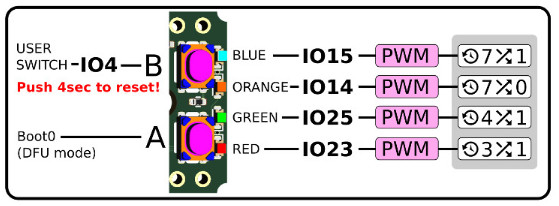
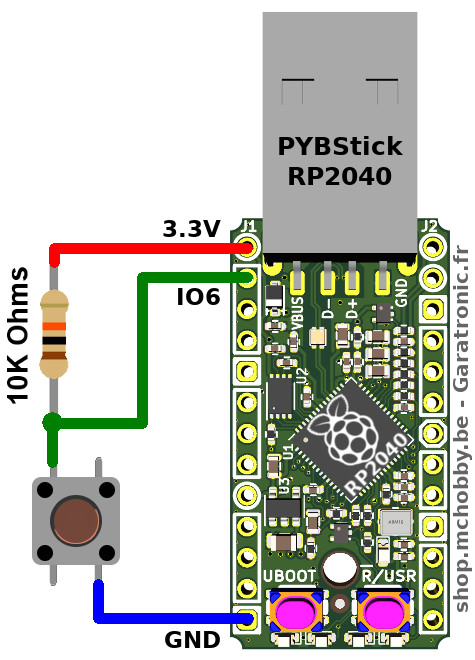
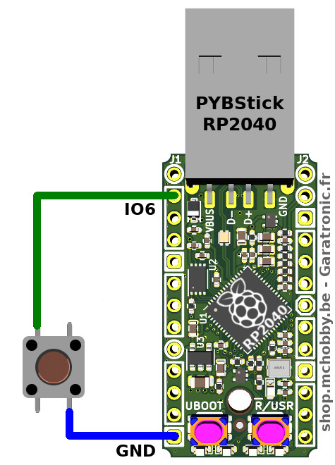
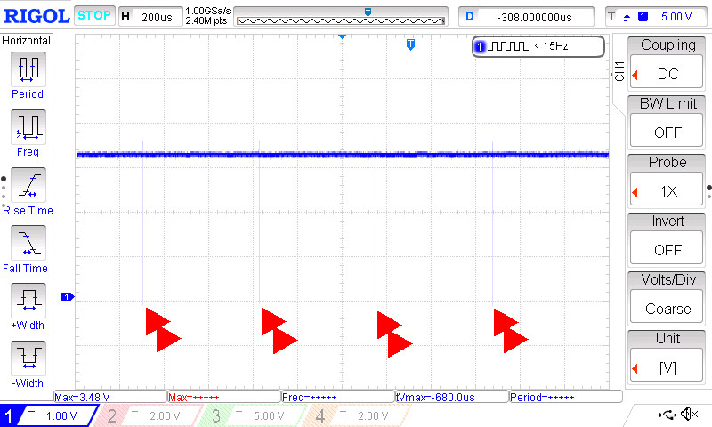
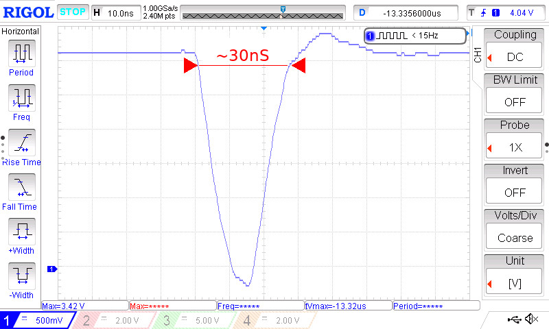
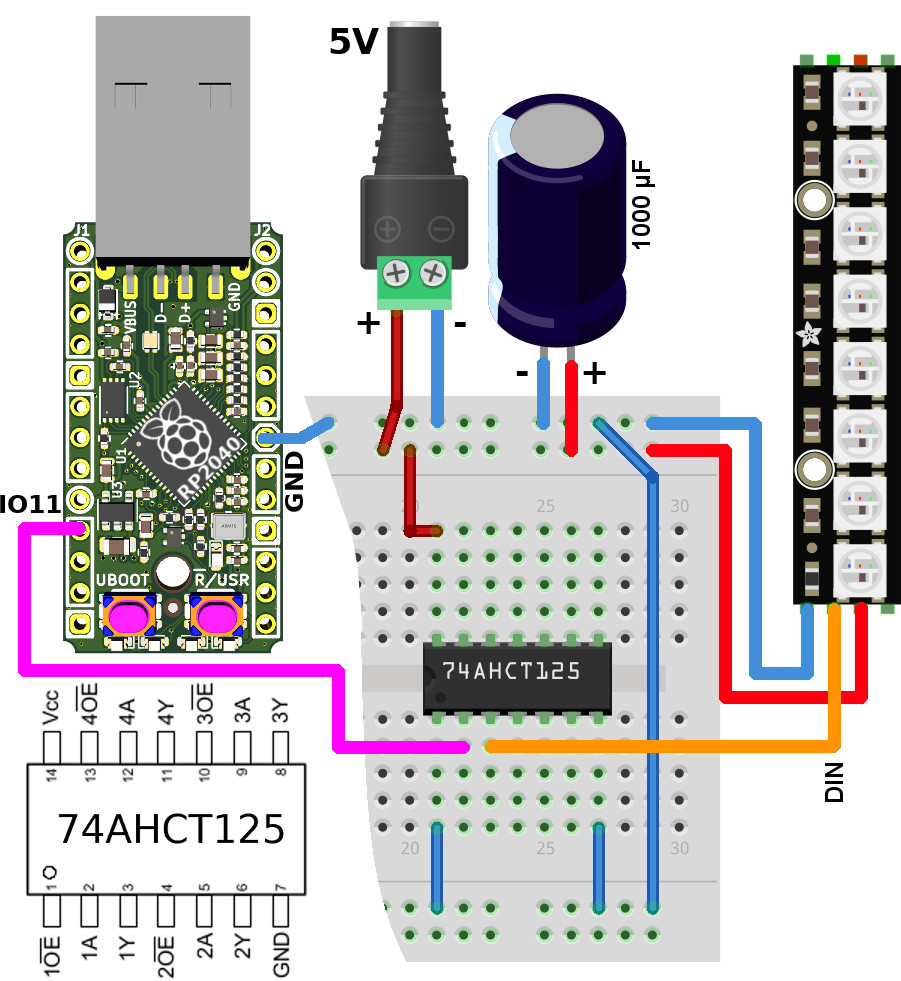
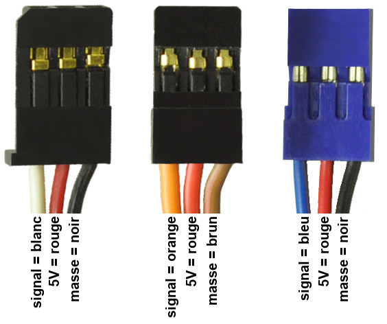
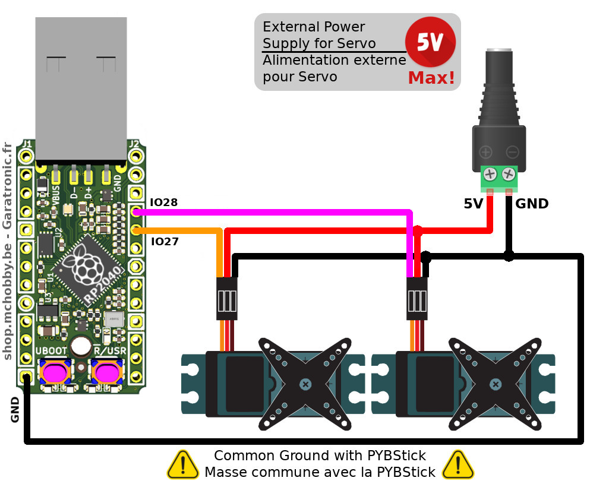

# PYBStick-RP2040 : La carte MicroPython compacte basé sur le RP2040

__UNDER WRITING - WILL BE TRANSLATED LATER__

Les cartes PYBStick sont issues d'un projet démarré par Garatronic et MCHobby
pour rendre l'accès à la programmation MicroPython et Arduino plus abordable,
pratique et documenté en Français.

Si la [PYBStick standard est basée sur le puissant STM32](https://github.com/mchobby/pyboard-driver/tree/master/PYBStick), ce modèle ci est
basé sur le puissance microcontrôleur double coeur de la fondation Raspberry-pi : le [RP2040](https://shop.mchobby.be/fr/ic-cms/2146-microcontroleur-raspberry-pi-rp2040-double-coeur-cortex-m0-133mhz-3232100021464.html).

Le RP2040 est ce même microcontrôleur qui équipe le désormais célèbre [Raspberry-Pi Pico](https://shop.mchobby.be/fr/pico-rp2040/2036-pico-header-rp2040-microcontroleur-2-coeurs-raspberry-pi-3232100020368.html)
qui supporte MicroPython et d'autres environnements de développement... que demander de plus?


Toujours avec le même facteur de forme, la PYBStick-RP2040 reste très compacte et abordable.

# PYBStick RP2040

La version PYBStick RP2040 26 est équipée d'un RP2040 cadencé à 133 MHz.
Il s'agit d'un double coeur cortex M0+, processeur 32 bits ARM.

[Fiche technique du RP2040](https://datasheets.raspberrypi.com/rp2040/rp2040-datasheet.pdf) (pdf).


# Alimentation

Le plus simple pour alimenter votre PYBStick est d'utiliser le connecteur USB.

D'autres options d'alimentation sont possibles et s’avéreront utile pour les projets énergivores (ex: plateformes motorisées).

## Alimenté par USB: (le plus facile)
* La broche VBUS est à 5.00V à 5.25V (tension standard USB).
* La broche VIN est à 4.85V (à cause de la chute de tension dans la diode Schottky B5817WS)
* La broche 3.3V produit une tension de 3.3V (300 mA) par l'intermédiaire du régulateur de tension ME6215C33. --- A VERIFIER

Dans cette configuration, il est également possible de brancher une source d'alimentation externe sur VIN. La courant de cette alimentation externe sera bloqué par la diode Schottky et ne pourra donc pas se déverser dans la connexion USB.

Si vous comptez brancher une alimentation externe sur VIN et connecter la PYBStick en USB en même temps alors il sera nécessaire de placer une diode en série avec alimentation externe (pour empêcher VBUS de déverser un courant dans l'alimentation externe).

## Alimenté par VIN: (18V max) --- A VERIFIER

* La broche VIN peut recevoir une alimentation externe (18V max). Si le connecteur USB est succeptible d'être branché en même temps, il faut prévoir une diode Schottky (voir point précédent).
* La broche VBUS est à 0V (si la plateforme n'est pas connectée sur une source USB).
* La broche 3.3V produit une tension de 3.3V par l'intermédiaire du régulateur de tension 3.3V.

## Alimenté par 3.3V:

Non recommandé et réservé à un public averti!

Il est possible de brancher une source d'alimentation derrière le régulateur de tension (donc sur la broche 3.3V). Dans ce cas, vous ne pouvez plus alimenter la carte via VIN ou USB (VBUS).

Toute erreur de tension ou de polarisation sur cette broche entraînera la destruction immédiate de la carte.

## Alimentation LiPo:

La PYBStick ne dispose pas d'un contrôleur LiPo mais il est tout à fait possible d'ajouter un ACCU Lipo sur votre PYBStick à l'aide d'un PowerBoost d'Adafruit.

Si vous voulez pouvoir recharger l'accu sans couper l'alimentation du projet alors il faudra opter pour un "PowerBoost Chargeur" (PowerBoost 500 Chargeur ou le PowerBoost 1000 Chargeur ).

En utilisant la broche VBUS (qui est à 5V lorsque la PYBStick est branchée en USB), il est possible d'alimenter le module PowerBoost pour que celui-ci recharge  l'accu. Il n'est donc pas nécessaire d'utiliser le connecteur MicroUSB de PowerBoost.


## Logique 3.3V

Les plateforme RP2040 fonctionnent en logique 3.3V __SANS TOLERANCE 5V__.

Le régulateur de tension présent sur la carte (ME6215C33) est capable de produire un courant de 300mA (350 max). La protection sur-courant s'activera à 500 mA.

### Schéma
* [Schéma PYBStick RP2040](docs/pybstick26_rpi2040_schematics_r1dot1.pdf) (___pdf___)

# Bibliothèque

Les bibliothèques suivantes sont nécessaires pour exploiter toutes les fonctionnalités de la carte. Les bibliothèques doivent être accessibles dans le système de fichiers de la carte MicroPython (à la racine ou dans un sous-répertoire `lib`).

## Bibliothèque "servo"
La bibliothèque [`servo.py`](lib/servo.py) expose la classe `Servo` qui permet de contrôler des servo-moteurs ainsi que des moteurs continus à contrôleur Servo (voir exemples plus bas).


## Bibliothèque "buzzer"
La bibliothèque [`buzzer.py`](lib/buzzer.py) permet de contrôler un Piezo Buzzer branché sur la sortie IO7.

Les méthodes disponibles permettent de jouer une tonalité arbitraire, des notes de musique et même de mini séquences musicales encodées dans une chaîne de caractères.

L'utilisation de cette bibliothèque est décrite plus bas dans la section "Buzzer".

## Bibliothèque "ws2812"
La bibliothèque [`ws2812.py`](lib/ws2812.py) reprend le code nécessaire pour utiliser efficacement des LEDs WS2812 / NeoPixel sur la broche IO11.

Cette bibliothèque n'est pas utilisée dans les exemples ci-dessous mais sera particulièrement utile dans vos propres développements.

# Prise en main

Cette section reprend l'utilisation des différents éléments de la carte.

## Bouton utilisateur (B)

Le bouton B correspond au bouton utilisateur. Il est facile de lire l'état de ce bouton en utilisant la classe `Pin`.

__Presser le bouton pendant 4 secondes redémarre la carte (Reset)__

Le lecteur attentif notera que l'état du bouton est inversé!

``` python
>>> from machine import Pin
>>> usr = Pin( 4, Pin.IN )
>>>
>>> # Bouton non pressé --> Valeur = 1 !!
>>> usr.value()
1
>>> usr.value()
1
>>>
>>> # Bouton pressé --> Valeur = 0 !!
>>> usr.value()
0
>>> usr.value()
0
```

A noter que l'usage de la classe `Signal` permet d'inverser la valeur du signal très simplement pour revenir vers une logique positive.

``` python
>>> from machine import Pin, Signal
>>> usr = Pin( 4, Pin.IN )
>>> btn = Signal( usr, invert=True )
>>>
>>> # Revenir en logique positive
>>> # Bouton non pressé --> Valeur = 0
>>> btn.value()
0
>>>
>>> # Bouton pressé --> Valeur = 1
>>> btn.value()
1
```

## Bouton Boot0 (A)

L'état de ce bouton ne peut pas être consulté par un script utilisateur.

Lorsque le bouton est pressé à la mise sous tension du microcontrôleur (ou Reset), celui-ci passe en _mode bootloader_ afin d'effectuer une mose-à-jour du firmware (MicroPython dans ce cas).

## LEDs utilisateurs

La PYBStick-RP2040 dispose de 4 LEDs de couleurs qui peuvent être contrôlées depuis le script utilisateur.

Sur la PYBStick-RP2040, il est possible de contrôler l'intensité des 4 LEDs.



Si la méthode `value()` est probablement l'approche recommandée pour modifier l'état d'une broche (donc éteindre ou allumé une LED), il existe également d'autres approches.

Le script ci-dessous manipule l'état des LEDs avec les différentes méthodes utilisables.

``` python
>>> from machine import Pin
>>> lblue = Pin( 15, Pin.OUT ) # Led BLEUE  (blue)
>>> lora = Pin( 14, Pin.OUT )  # Led ORANGE (orange)
>>> lgre = Pin( 25, Pin.OUT )  # Led VERTE  (green)
>>> lred = Pin( 23, Pin.OUT )  # Led ROUGE  (red)
>>>
>>> # Manipuler les LEDs
>>> lblue.on()     # Allumer Led Bleue
>>> lblue.off()    # Eteindre
>>>
>>> # Utiliser value() pour changer l'état de la broche
>>> lora.value(1)  # Allumer led ORANGE
>>> lora.value(0)
>>>
>>> # Utiliser high() et low()
>>> #    à la place de on() et off()
>>> lgre.high()
>>> lgre.low()
>>>
>>> # La méthode
>>> lred.on()
>>> lred.toggle()
```

## Broche Numérique - en entrée

La lecture de l'état d'une entrée se fait à l'aide de la classe `Pin` configurée en entrée.



* Lorsque le bouton est pressé, le potentiel de la broche IO6 est placé/connecté à la masse.
* Lorsque le bouton est relâché, la broche IO6 est rappelée à +3.3V par la résistance de 10 KOhms.

L'exemple ci-dessous permet de lire l'état de la broche d'entrée. A noter que la lecture de l'état retourne 0 (équivalent de `False`) lorsque le bouton est pressé. Nous sommes donc dans une logique inversée.

``` python
>>> from machine import Pin
>>> p = Pin( 6, Pin.IN )
>>> # Ne pas presser le bouton
>>> p.value()
1
>>> # Presser le bouton
>>> p.value()
0
```

La microcontrôleur peut également activer une résistance pull-up interne, ce qui permet d'éviter le montage de la résistance de 10 KOhms.



Le script suivant affiche l'état du bouton toutes les demi-secondes. Presser Ctrl+C pour stopper le script.

``` python
>>> from machine import Pin
>>> from time import sleep
>>> p = Pin( 6, Pin.IN, Pin.PULL_UP  )
>>> while True:
>>>     s = "..." if p.value() else "Pressé"
>>>     print( s )
>>>     sleep( 0.5 )
>>>
```

## Broche Numérique - en sortie

Une broche en sortie permet au script de contrôler l'état de la broche (niveau haut ou nouveau bas). Cela se fait également par l'intermédiaire de la classe `Pin`.

La broche du microcontrôleur peut donc commander un périphérique externe uniquement si celui-ci consomme un faible courant (par exemple, une LED ou une carte breakout).

__Attention:__ Pour commander un périphérique énergivore comme un moteur ou un relais, il est impératif de passer par une interface d'amplification appropriée.

Le montage suivant permet de contrôler une LED par l'intermédiaire d'une résistance de 1K Ohms. __Cette résistance permet de limiter le courant__ lorsque la LED devient conductrice et émet de la lumière. Sans cette résistance, le courant tendra vers l'infini (ce qui détruira le microcontrôleur).


``` python
>>> from machine import Pin
>>> p = Pin( 28, Pin.OUT )
>>>
>>> # Sortie au Niveau Haut (3.3V) -> Allume LED
>>> p.value( 1 )
>>>
>>> # Sortie au Niveau Bas (0V) -> LED éteinte
>>> p.value( 0 )
```
Le script suivant produit un effet de battement de coeur

``` python
>>> from time import sleep_ms
>>> from machine import Pin
>>> p = Pin( 28, Pin.OUT )
>>> while True:
>>>     sleep_ms( 1300 ) # Attendre 1100 millisecondes
>>>     p.value( 1 ) # Allume LED
>>>     sleep_ms( 80 )
>>>     p.value( 0 ) # Eteindre LED
>>>     sleep_ms( 80 )
>>>     p.value( 1 ) # Allume LED
>>>     sleep_ms( 80 )
>>>     p.value( 0 ) # Eteindre LED
>>>
```

## Entrée analogique (3.3 V max)

La carte est équipée de de plusieurs entrée analogiques IO26 = adc0, IO27 = adc1, IO28 = adc2.

Attention: en aucun cas la tension appliquée sur l'entrée analogique ne peut être supérieure à 3.3V au risque de détruire le microcontrôleur.

Celle-cis peuvent être utilisés pour lire une tension entre 0 et 3.3V et retourne un entier 16 bits (0 à 65535)

Le graphique suivant utilise un potentiomètre de 10 KOhms linéaire pour générer une tension entre 0 et 3.3V sur l'entrée 26.


En tournant le potentiomètre, la tension varie sur l'entrée analogique et le résultat est visible sur l'information retournée par le convertisseur analogique digital.

Le script suivant affiche la valeur du convertisseur toutes les 300ms

``` python
>>> from pyb import ADC
>>> from time import sleep
>>> adc26 = ADC(26)
>>> while True:
>>>     print( 'Valeur ADC:', adc26.read_u16() )
>>>     print( 'Volts:', 3.3*adc26.read_u16()/65535 )
>>>     sleep( 0.3 )
```

__Attention: Résolution ADC et valeur 16 16bits__

Le convertisseur analogique du RP2040 à résolution de 12 bits. Cela signifie que la valeur retournée par l'électronique varie entre 0 et 4095.

La méthode `read_u16()` applique donc un coefficient multiplicateur pour pouvoir retourner une valeur entre 0 et 65535.

La résolution maximale du convertisseur est limitée par sa résolution électronique (12 bits), celle-ci est de 3.3V / 4096 = 0.000805 Volts (soit 0.8 mV).

__Parasites:__ un potentiomètre étant constitué d'un curseur se déplaçant le long d'une résistance, il n'est pas rare d'avoir des faux-contacts et effets transitoires. Si ceux-ci sont faible et très court, ils peuvent néanmoins planter un convertisseur ADC (démontré sur un ADC1115). Si vous expérimentez ce type de désagrément, placez alors une capacité de 10nF entre la sortie du signal et la masse :-)

##  Sortie Analogique (DAC)

La PYBStick-RP2040 ne dispose pas de sortie analogique (DAC).

Il est cependant possible de créer une [sortie analogique avec un MCP4725](https://github.com/mchobby/esp8266-upy/tree/master/mcp4725).

## Sortie PWM

Presque toutes les sorties du PYBStick-RP2040 sont capable de générer un signal PWM (aussi dit MLI en Français pour Modulation de Longueur d'Impulsion).


``` python
>>> from machine import PWM
>>> p = PWM( Pin(28) )
>>> # Verifier la Frequence PWM
>>> p.freq()
1907 # 1.9 KHz
>>> p.duty_u16( 65534 ) # 99.99% cycle utile
>>> p.duty_u16( 32768 ) # 50% cycle utile
>>> p.duty_u16( 0 ) # 0% cycle utile
```

__Attention à la valeur 65535 !!!!__

La valeur 65535 devrait être 100% de cycle utile. Celle-ci est théoriquement valide! (cas sous MicroPython v1.15, peut être corrigé dans la version v1.17).

Cependant celle-ci produit un signal à 0 Volts. Il y a là une erreur à corriger dans le Firmware (qui le sera certainement prochainement).

A défaut, il est possible d'utiliser la __valeur 65534__ qui est un __cycle utile à 99.99%__ comme l'indique la capture ci-dessous.

Le temps d'arrêt étant de l'ordre 30ns pour une période de 524383.8ns (ou 0.5243838 ms)





__deinit()__

Si vous n'avez plus besoin d'utiliser du signal PWM sur la broche, vous pourrez utiliser la méthode `deinit()`.

``` python
 p.deinit()
 ```

## Buzzer

L'utilisation d'un Buzzer sur PYBStick se fait à l'aide d'un signal PWM dont on modifie la fréquence.

La bibliothèque `buzzer.py` propose la classe Buzzer qui permet de:

* jouer une tonalité arbitraire
* jouer une note de musique
* Jouer une petite séquence musicale


Une résistance de 330 Ohms est nécessaire pour limiter le courant. Il est aussi recommandé d'ajouter [une diode en roue libre comme décrit dans cet article](https:/arduino103.blogspot.com/2020/06/quelle-resistance-sur-un-piezo-buzzer.html).  


L'exemple ci-dessous, issus du script ['test_buzzer.py'](examples/test_buzzer.py), indique comment produire une tonalité sur le buzzer.

```
from buzzer import Buzzer
from time import sleep

bz = Buzzer()
# Jouer un Do @ 523 Hertz
bz.tone( 523 )
sleep( 1 )
# Silence
bz.tone()
```

Il est également possible de jouer des séquences musicales à l'aide de la méthode `tune()` comme le démontre l'exemple [`test_buzzer_tune.py`](examples/test_buzzer_tune.py) .

```
from buzzer import Buzzer
from time import sleep

bz = Buzzer()

# Liste de notes + rythme (séparée par des virgules)
#   1ier caractère = la note tels de définie dans le dictionnaire NOTES
#   2ieme caractère = duree de la note (1 si manquant)
tune1 = "c,c,g,g,a,a,g2,f,f,e,e,d,d,c2, 4"
bz.tune( tune1, tempo=300 ) # plus lent
sleep(1)
tune2 = "c2,c,d3,c3,f3,e3,c2,c,d3,c3,g3,f3, 4"
bz.tune( tune2, tempo=200 ) # plus rapide
```

Enfin l'exemple [`test_buzzer_notes.py`](examples/test_buzzer_notes.py) indique comment jouer une simple note.

## NeoPixel

Controler des NeoPixels est assez facile comme le démontre les exemples [neopixel.py](examples/neopixel.py) et [neopixel2.py](examples/neopixel2.py) .


L'utilisation de Neopixels nécessite la présence de routines utilitaires dans le script. Ces routines sont reprises ci-dessous mais également disponible dans le script [neopixel.py](examples/neopixel.py)

``` python
import array
from machine import Pin
import rp2

# WS2812 Configuration.
NUM_LEDS = 8 # Nombre de LEDs
PIN_NUM = 11 # Broche de sortie
brightness = 0.2 # Luminosité (0 à 1, 0.2 est déjà très lumineux)

######################## NEOPIXEL UTILITY ######################################
@rp2.asm_pio(sideset_init=rp2.PIO.OUT_LOW, out_shiftdir=rp2.PIO.SHIFT_LEFT, autopull=True, pull_thresh=24)
def ws2812():
    T1 = 2
    T2 = 5
    T3 = 3
    wrap_target()
    label("bitloop")
    out(x, 1)               .side(0)    [T3 - 1]
    jmp(not_x, "do_zero")   .side(1)    [T1 - 1]
    jmp("bitloop")          .side(1)    [T2 - 1]
    label("do_zero")
    nop()                   .side(0)    [T2 - 1]
    wrap()


# Create the StateMachine with the ws2812 program, outputting on pin
sm = rp2.StateMachine(0, ws2812, freq=8_000_000, sideset_base=Pin(PIN_NUM))

# Start the StateMachine, it will wait for data on its FIFO.
sm.active(1)

# Display a pattern on the LEDs via an array of LED RGB values.
ar = array.array("I", [0 for _ in range(NUM_LEDS)])

def pixels_show():
    dimmer_ar = array.array("I", [0 for _ in range(NUM_LEDS)])
    for i,c in enumerate(ar):
        r = int(((c >> 8) & 0xFF) * brightness)
        g = int(((c >> 16) & 0xFF) * brightness)
        b = int((c & 0xFF) * brightness)
        dimmer_ar[i] = (g<<16) + (r<<8) + b
    sm.put(dimmer_ar, 8)
    time.sleep_ms(10)

def pixels_set(i, color):
    """ Assigne une couleur (r,g,b) à un pixel numéroté de 0 à N-1 """
    ar[i] = (color[1]<<16) + (color[0]<<8) + color[2]

def pixels_fill(color):
    """ Remplit le ruban avec une couleur donnée """
    for i in range(len(ar)):
        pixels_set(i, color)

BLACK = (0, 0, 0)
RED = (255, 0, 0)
YELLOW = (255, 150, 0)
GREEN = (0, 255, 0)
CYAN = (0, 255, 255)
BLUE = (0, 0, 255)
PURPLE = (180, 0, 255)
WHITE = (255, 255, 255)
COLORS = (BLACK, RED, YELLOW, GREEN, CYAN, BLUE, PURPLE, WHITE)

##########################################################################
```

La mise en place de ces fonctions utilitaires est relativement simple (voir [examples/neopixel.py](examples/neopixel.py) )!

``` python
# Tous les pixels de la même couleur
#
pixels_fill( RED )   # Remplir en Rouge
pixels_show()        # Envoi des données sur le Ruban
time.sleep( 2 )      # Attendre 2 seconde
pixels_fill( GREEN ) # en Vert
pixels_show()
time.sleep( 2 )
pixels_fill( BLUE )  # en Bleu
pixels_show()
time.sleep( 2 )

# Eteindre le ruban
pixels_fill( BLACK ) # Remplir en noir
pixels_show()
time.sleep( 2 )

# Assigner la couleur Pixel par Pixel
#
pixels_set( 0, RED )   # Pixel 0 en Rouge
pixels_set( 1, GREEN ) # Pixel 1 en Vert
pixels_set( 2, BLUE )  # Pixel 1 en Bleu
pixels_set( 3, YELLOW )# ...
pixels_set( 4, CYAN )
pixels_set( 5, PURPLE )
pixels_set( 6, WHITE )
pixels_set( 7, RED )
pixels_show()          # Envoi des données sur le Ruban
time.sleep( 4 )        # Attendre 4 secondes

# Eteindre le Ruban
pixels_fill( BLACK )   
pixels_show()
time.sleep( 2 )
```

__Tester l'exemple:__

Après avoir copié le fichier `neopixel.py` sur le système de fichier MicroPython, il
est possible d'en exécuter le contenu depuis une session REPL en utilisant l'instruction suivante:

``` python
>>> import neopixel
```

Le second exemple [examples/neopixel2.py](examples/neopixel2.py) présente des fonctions complémentaire comme:
* `color_chase()` -
* `wheel()` - roue des couleurs
* `rainbow_cycle()` - cycle des couleurs style "arc en ciel".

## NeoPixel : bibliothèque et fxdemo

Depuis l'écriture initiale de cette documentation, la bibliothèque [lib/ws2812.py](lib/ws2812.py) a été ajoutée dans le dépôt.

La bibliothèque permet d'écrire un code beaucoup plus concis comme celui présenté dans l'exemple [neopixel3.py](examples/neopixel3.py) visible ci-dessous.

``` python
import ws2812 as ws
import time

leds = ws.WS2812( pin_num=11, num_leds=12, brightness=0.2 )
for color in ws.COLORS:
	leds.fill(color)
	leds.write() # show() will also work
	time.sleep(0.2)

leds.clear()
```

Un dernier fichier d'exemple [fxdemo.py](examples/fxdemo.py) déclare et exploite une série de fonction permettant de réaliser des effets lumineux.

Ces fonctions sont une copie exacte [des routines NeoPixels définies dans le dépôt esp8266-upy](https://github.com/mchobby/esp8266-upy/tree/master/neopixel).

## NeoPixel sous 5V

Conformément aux spécifications WS2812, le signal de données doit être au même niveau logique que la tension d'alimentation des Pixels.

Les montages mentionnant des Pixels alimentés sous 5V avec un signal de données en 3.3V sont malheureusement erronés. Il n'est pas assuré que cela soit fiable et assure une fonctionnement stable.

Pourtant, alimenter les Pixels sous 5V offrent une meilleure luminosité et peut aussi assurer une meilleure alimentation de grandes quantités de pixels.

Pour utiliser des Neopixels alimentés sous 5V, il est vivement recommandé d'utiliser un _Level Shifter_ 74AHCT125 sur la ligne de données.

Voici comment réaliser ce montage.




## DotStar / APA102

TODO

## Servo

Les servo-moteurs sont des moteurs dont il est possible de contrôler la position angulaire de l'axe. Ils permettent, par exemple, de contrôler la direction d'un véhicule ou d'un gouvernail, l'ouverture ou la fermeture/ouverture d'une trappe, contrôle d'un bras robotisé.

Par défaut, la classe émet un signal entre 1.0 à 2.0ms (0 à 180°) avec un centrage à 1.5ms (90°).

Le servo moteur se branche par l'intermédiaire d'un connecteur 3 pôles (6V max) respectant un ordre spécifique (mais parfois avec des couleurs différentes). En voici un petit récapitulatif.



Voici le raccordement d'un SG5010:


Après avoir copié la bibliothèque [lib/servo.py](lib/servo.py), il est possible d'utiliser de tester le servo-moteur.

``` python
>>> from servo import Servo
>>> s = Servo(26)
>>> s.angle(10)
>>> s.angle(20)
>>> s.angle(30)
>>> s.angle(60)
>>> s.angle(80)
>>> s.angle(100)
>>> s.angle(110)
>>> s.angle(130)
>>> s.angle(160)
>>> s.angle(180)
>>> s.detach()
```

la méthode `detach()` permet de relâcher le contrôle du servo-moteur. pour réactiver le contrôle, il suffit de refaire un nouvel appel à `angle()` .

La classe `Servo` propose également une méthode `calibration()` permettant de fixer les données de pulsation pour des modèles moins standard.

Voici un exemple correspondant au servo-moteur Parallax ou servo-moteur SG90 dont la pulsation s'étend de 500ms à 2500ms:


``` python
>>> from servo import Servo
>>> s = Servo(26)
>>> s.calibration( pulse_min=0.5, pulse_max=2.5, pulse_center=1.5 )
>>> s.angle(0)
>>> s.angle(90)
>>> s.angle(180)
>>> s.detach()
```

Pour utiliser plusieurs servo avec la carte PYBStick-RP2040, il est vivement recommandé d'utiliser une alimentation externe.



``` python
>>> from servo import Servo
>>> s1 = Servo(27)
>>> s2 = Servo(28)
>>> s1.angle(45)
>>> s2.angle(105)
```

## Moteur continu à commande Servo

Il existe également des moteurs continu que l'on peu commander à l'aide d'un signal de servo-moteur.

C'est le cas de ce [Micro moteur 75:1 Gravity avec contrôleur Servo de DFRobot](https://shop.mchobby.be/product.php?id_product=1811) disponible chez MCHobby qui se couple parfaitement au [Zumo Chassis (sans moteur)](https://shop.mchobby.be/product.php?id_product=447).

Grâce à un seul fils de commande transportant le signal Servo et au contrôleur équipant le moteur, il est possible de commander ce moteur:
* En marche/l'arrêt
* En vitesse
* En sens de rotation

Cela ravira les nouveaux venus car il n'y a pas à se compliquer la vie avec les raccordement d'un circuit de puissance moteur (L293/L298), etc tout est déjà présent sur le moteur.


``` python
>>> from servo import Servo
>>> s = Servo( 26 )
>>> s.calibration( pulse_min=0.5, pulse_max=2.5, pulse_center=1.5 )
>>> s1.speed( +100 ) # sens anti-horlogique, vitesse 100%
>>> s1.speed( -100 ) # Sens horlogique, vitesse 100%
>>> s1.speed( -50 )  # Sens horlogique, vitesse 50%
>>> s1.speed( -10 )  # Sens horlogique, vitesse 10%
>>> s1.speed( 0 )    # Arrêt
```

## Bus I2C

TODO

## Bus UART

TODO

## Bus SPI

TODO

# Bouton Reset et Boot0

TODO

# Ressources

## Firmwares

TODO

## Des pilotes micropython

MCHobby SPRL développe de nombreux pilotes MicroPython mis à disposition gratuitement. Ce projet à débuté avec l'écriture du Livre "[Python, Raspberry Pi et Flask](https://www.editions-eni.fr/livre/python-raspberry-pi-et-flask-capturez-des-donnees-telemetriques-et-realisez-des-tableaux-de-bord-web-9782409016318)" et prolongé avec le livre "[MicroPython et Pyboard](https://www.editions-eni.fr/livre/micropython-et-pyboard-python-sur-microcontroleur-de-la-prise-en-main-a-l-utilisation-avancee-9782409022906)", ouvrages écris par Dominique (de chez MCHobby).

Il s'agit de pilotes multi-plateformes (fonctionnant indépendamment de la plateforme MicroPython):

* [__GitHub ESP8266__ - Pilote MicroPython](https://github.com/mchobby/esp8266-upy)
* [__GitHub Pyboard-Driver__](https://github.com/mchobby/pyboard-driver) des pilotes MicroPython gourmand en ressources (donc plutôt réservé à des carte puissante comme PYBStick Pro, Pyboard, PYBD)

## PYBStick Drawing

__Image PNG:__

Envie de faire vos propres schéma à base de PYBStick? Pas de problème, nous avons prévu une image PNG avec fond transparent en 3 résolution. Nous les utilisons régulièrement avec Gimp.
* [PYBStick-RP2040-template(640px).png](docs/_static/pybstick-rp2040-template(640px).png) - 640 pixels de haut
* [PYBStick-RP2040-template(800px).png](docs/_static/pybstick-rp2040-template(800px).png) - 800 pixels de haut
* [PYBStick-RP2040-template.png](docs/_static/pybstick-rp2040-template.png) - la plus haute résolution

# Shopping List
* [PYBStick RP2040](https://shop.mchobby.be/product.php?id_product=2331)
* [PowerBoost 500 Charger](https://shop.mchobby.be/product.php?id_product=534)
* [Micro moteur 75:1 Gravity avec contrôleur Servo de DFRobot](https://shop.mchobby.be/product.php?id_product=1811)
* [Zumo Chassis (sans moteur)](https://shop.mchobby.be/product.php?id_product=447)
