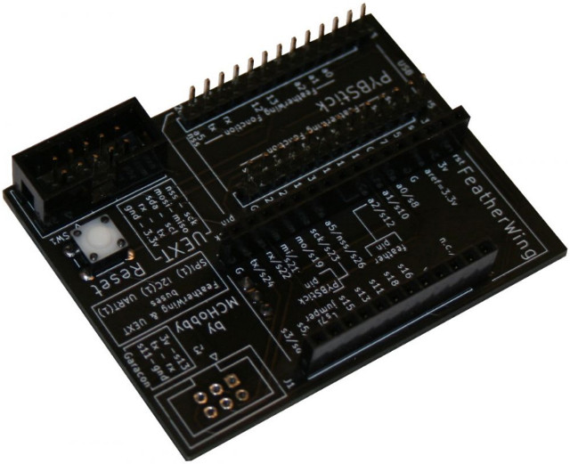
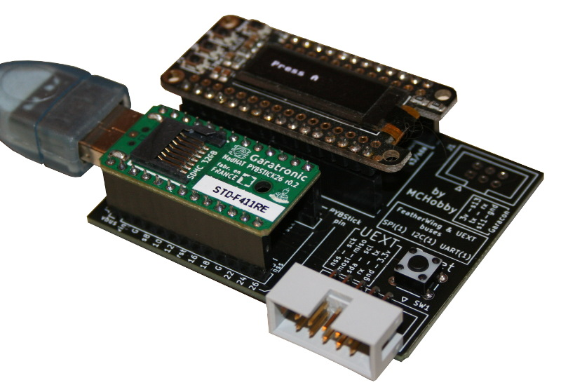
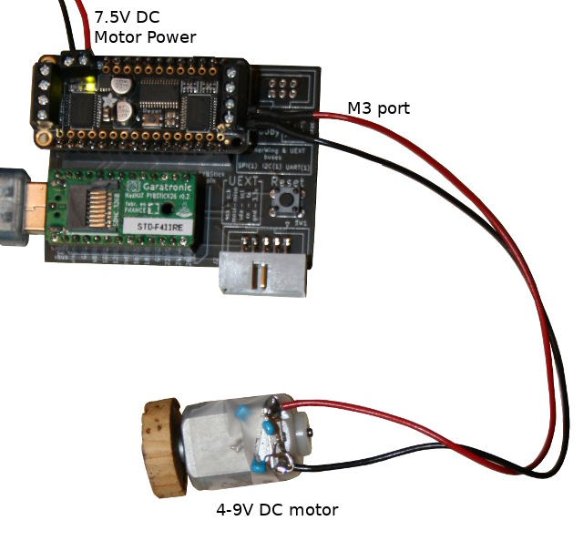
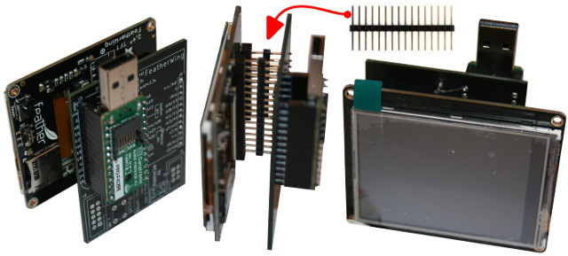
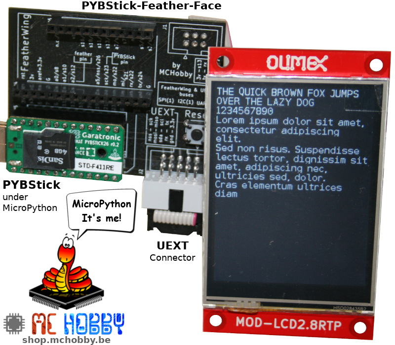

[This file also exists in ENGLISH](readme_ENG.md)

# Interface Feather pour PYBStick

le [kit PYBStick-Feather-Face](https://shop.mchobby.be/fr/pybstick/1996-carte-d-interface-feather-et-uext-pour-pybstick-3232100019966.html) permet de réunir le meilleur des deux mondes : la PYBStick et les extensions FeatherWing. Les bus et fonctions Feather ont été mappés sur ceux de la PYBStick, de sorte, les bus I2C, SPI et UART sont disponibles aux bons endroits sur l'interface Feather :-) . Le Feather M0 Express fut pris comme référence pour l'étude du mapping.



La sérigraphie reprend également toute l'information nécessaire à l'exploitation de cette carte d'interface.

Il est maintenant possible de brancher une carte d'extension Feather (ex: Motor FeatherWing) sur la PYBStick puis simplement utiliser les bibliothèques existantes (en adaptant le nom des broches) pour controler la dite carte moteur depuis votre la carte PYBStick. Cool n'est ce pas?

 <br />[Schéma du PYBStick-Feather-Face](docs/_static/pybstick-feather-face0.jpg)


# Exemple avec OLED FeatherWing

Attention à bien désactiver la broche #6 du FeatherWing (ouvrir le cavalier) car la Pull-Up présente sur le bouton B du FeatherWing active le mode DFU de la PYBStick.


Le bouton C pour sa part est branché sur la broche #5 du FeatherWing (qui pourra etre branché sur la PYBStick grace au cavalier).

L'exemple [test_oled_wing.py](examples/test_oled_wing.py) permet de tester l'OLED FeatherWing.

__Bibliothèques:__

Il est nécessaire d'installer les bibliothèques sur la PYBStick.
* [La bibliothèque ssd1306](https://raw.githubusercontent.com/micropython/micropython/master/drivers/display/ssd1306.py)

__Executer:__

Après avoir chargé `test_oled_wing.py`, il est possible de l'exécuter depuis une session REPL en saisissant `import test_oled_wing` .

Créer une instance de l'afficheur OLED est vraiment très simple:

``` python
import ssd1306
from machine import I2C
i2c = I2C(1)
lcd = ssd1306.SSD1306_I2C( 128, 32, i2c )

lcd.fill(0) # Rempli l'écran en noir
lcd.rect( 3, 3, 128-2*3, 32-2*3, 1 ) # rect( x, y, w, h, c )
lcd.text("Bonjour!", 10,10, 1 )
lcd.show()  # Afficher!
```

Ce qui produit le résultats suivants:



[Plus d'informations sur l'OLED FeatherWing sous MicroPython depuis cette page GitHub](https://github.com/mchobby/esp8266-upy/blob/master/oled-ssd1306/readme.md).

# Exemple avec Motor FeatherWing

Le script [test_motor_wing.py](examples/test_motor_wing.py) teste les 4 ports de sorties pour contrôler des moteurs continus sur les 4 ports M1, M2, M3, M4.

__Bibliothèques:__

Il est nécessaire d'installer les bibliothèques sur la PYBStick.
* [La bibliothèque motorbase.py](https://raw.githubusercontent.com/mchobby/esp8266-upy/master/adfmotors/lib/motorbase.py)
* [La bibliothèque motorwing.py](https://raw.githubusercontent.com/mchobby/esp8266-upy/master/adfmotors/lib/motorwing.py)
* [la bibliothèque pca9685.py](https://raw.githubusercontent.com/mchobby/esp8266-upy/master/pca9685/lib/pca9685.py)

__Executer:__

Après avoir chargé `test_motor_wing.py`, il est possible de l'exécuter depuis une session REPL en saisissant `import test_motor_wing` .

L'image suivante présente un moteur 4.5-9V branché sur le port M3.



Créer une instance du FeatherWing moteur est vraiment très simple:

``` python
from motorwing import MotorWing
from motorbase import FORWARD, BACKWARD, BRAKE, RELEASE

import time
from machine import I2C
i2c = I2C(1)
m = MotorWing( i2c, address=0x60 )

motor = m.get_motor(3) # Port M3
motor.speed( 128 ) # between 0 & 255
motor.run( FORWARD )
```

Il y a de [nombreux autres exemples détaillant le fonctionnement du contrôleur moteur d'Adafruit](https://github.com/mchobby/esp8266-upy/tree/master/adfmotors) dans la bibliothèque [adfmotors](https://github.com/mchobby/esp8266-upy/tree/master/adfmotors). Le fonctionnement est identique entre le motor-Shield et le motor-FeatherWing

# Exemple TFT-2.4" FeatherWing

Le [pilote ili934x](https://github.com/mchobby/esp8266-upy/tree/master/ili934x) (sur le GitHub esp8266-upy) fut développé à l'aide de la configuration ci-dessous.



Pour les codes d'exemples, référez-vous [GitHub consacré au pilote ili934x](https://github.com/mchobby/esp8266-upy/tree/master/ili934x).

# Exemple UEXT

Le script [test_uext.py](examples/test_uext.py) le port UEXT pour contrôler un [MOD-IO2](https://shop.mchobby.be/fr/uext/1409-mod-io2-carte-d-extension-io-gpio-avec-connecteur-uext-3232100014091-olimex.html) et un afficheur à cristaux liquides [MOD-LCD-1x9](https://shop.mchobby.be/fr/uext/1414-mod-lcd1x9-afficheur-lcd-uext-1-ligne-de-9-caracteres-alphanumeriques-3232100014145-olimex.html) d'Olimex Ltd.


Le code utilisé est des plus simples:

 ``` python
 import modio2
 import modlcd19
 import mlx90614
 import time
 from machine import I2C
 i2c = I2C(1)

 lcd = modlcd19.MODLCD1x9( i2c )
 io  = modio2.MODIO2( i2c )

 lcd.write( 'MCHobby')
 lcd.update()

 io.relais[0] = True
 ```

__Bibliothèques:__

Il est nécessaire d'installer les bibliothèques sur la PYBStick.
* [La bibliothèque modio2.py](https://raw.githubusercontent.com/mchobby/esp8266-upy/master/modio2/modio2.py)
* [La bibliothèque modlcd19.py](https://raw.githubusercontent.com/mchobby/esp8266-upy/master/modlcd1x9/lib/modlcd19.py)

__Executer:__

Après avoir chargé `test_uext.py`, il est possible de l'exécuter depuis une session REPL en saisissant `import test_uext_wing` .

# Exemple UEXT avec MOD-LCD2.8RTP



Un second exemple UEXT exploitant un écran [MOD-LCD2.8RTP d'Olimex](https://shop.mchobby.be/fr/afficheur-lcd-tft-oled/1866-afficheur-28-tactile-couleur-320x240px-uext-3232100018662-olimex.html) est également disponible dans le dépot du [pilote ili934x](https://github.com/mchobby/esp8266-upy/tree/master/ili934x) (sur le GitHub esp8266-upy).

# Où acheter
* [PYBStick Feather-Face](https://shop.mchobby.be/fr/nouveaute/1996-carte-d-interface-feather-et-uext-pour-pybstick-3232100019966.html)
* [OLED FeatherWing](https://shop.mchobby.be/en/feather-adafruit/879-feather-ecran-oled-3232100008793-adafruit.html)
* [PYBStick Feather-Face](https://shop.mchobby.be/fr/nouveaute/1996-carte-d-interface-feather-et-uext-pour-pybstick-3232100019966.html)
* [OLED FeatherWing](https://shop.mchobby.be/en/feather-adafruit/879-feather-ecran-oled-3232100008793-adafruit.html)
