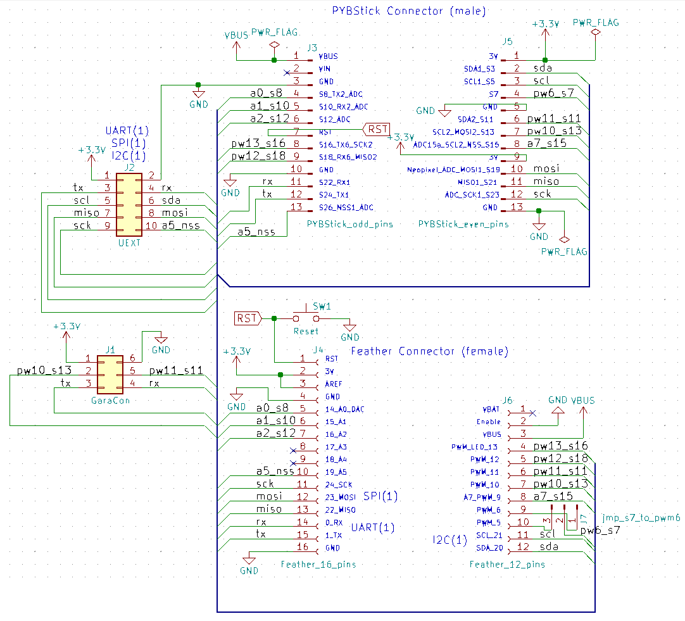
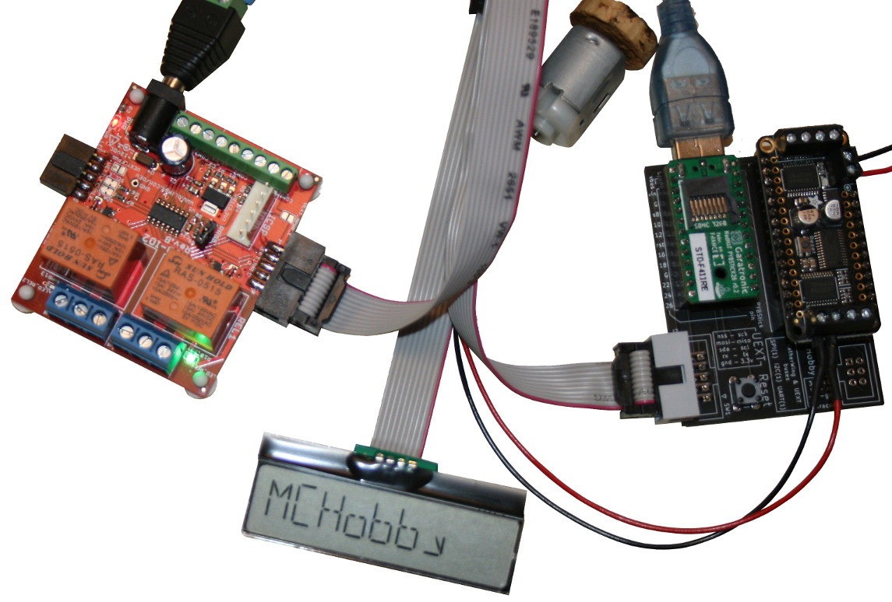

[Ce fichier existe aussi en FRANCAIS](readme.md)

# Feather interface for the PYBStick

The [kit PYBStick-Feather-Face kit](https://shop.mchobby.be/fr/pybstick/1996-carte-d-interface-feather-et-uext-pour-pybstick-3232100019966.html) does join the best of the  PYBStick with the FeatherWing extension. The bus and functions of the Feather have been mapped to the PYBStick, so, the I2C, SPI or UART bus are available at the right place on the feather interface :-) . The Feather M0 Express have been used as reference when preparing the pin mapping.


The silkscreen does contains all the required information to use this interface board.

It is now possible to use a Feather extension board on the (ex: Motor FeatherWing) with the PYBStick then use the existing library (and adapt pinout definition) to take the controle over the target FeatherWing extension with the PYBStick. That's great!

 <br />[PYBStick-Feather-Face schematic](docs/_static/pybstick-feather-face0.jpg)

# OLED FeatherWing example

Do not forget to remove the jumper to deactivate the FeatherWing's #6 pin otherwise, the B button on the Featherwing will active the DFU mode of the PYBStick.


The C button is wired on the #5 pin of the FeatherWing (can be used depending on the jumper setting).


The [test_oled_wing.py](examples/test_oled_wing.py) exemple is used to test the OLED FeatherWing.

__Library:__

You will need to install the following library on the PYBStick.
* [The ssd1306 library](https://raw.githubusercontent.com/micropython/micropython/master/drivers/display/ssd1306.py)

__Execute:__

Once the `test_oled_wing.py` file loaded onto the board, you can execute it from a REPL session with the command `import test_oled_wing` .

Create an OLED display instance is quite easy:

``` python
import ssd1306
from machine import I2C
i2c = I2C(1)
lcd = ssd1306.SSD1306_I2C( 128, 32, i2c )

lcd.fill(0) # Fill it black
lcd.rect( 3, 3, 128-2*3, 32-2*3, 1 ) # rect( x, y, w, h, c )
lcd.text("Bonjour!", 10,10, 1 )
lcd.show()  # Update display
```

Which produce the following result:


[PFor more information on the OLED FeatherWing under MicroPython, see this GitHub page](https://github.com/mchobby/esp8266-upy/blob/master/oled-ssd1306/readme.md).

# Motor FeatherWing example

The [test_motor_wing.py](examples/test_motor_wing.py) script test the 4 output port (to drive 4 DC motor) on the 4 ports M1, M2, M3, M4.

__Libraries:__

The following libraries must be installed on the PYBStick.
* [The motorbase.py library](https://raw.githubusercontent.com/mchobby/esp8266-upy/master/adfmotors/lib/motorbase.py)
* [The motorwing.py library](https://raw.githubusercontent.com/mchobby/esp8266-upy/master/adfmotors/lib/motorwing.py)
* [The pca9685.py library](https://raw.githubusercontent.com/mchobby/esp8266-upy/master/pca9685/lib/pca9685.py)

__Execute:__

After copying the `test_motor_wing.py` file on the board, you can execute it from a REPL session with the command `import test_motor_wing` .

The following images shows a 4.5-9V DC motor wired on the M3 port.


Creating an instance of FeatherWing motor is quite easy:

``` python
from motorwing import MotorWing
from motorbase import FORWARD, BACKWARD, BRAKE, RELEASE

import time
from machine import I2C
i2c = I2C(1)
m = MotorWing( i2c, address=0x60 )

motor = m.get_motor(3) # Port M3
motor.speed( 128 ) # between 0 & 255
motor.run( FORWARD )
```

It exists [many other examples about the Adafruit motor controler](https://github.com/mchobby/esp8266-upy/tree/master/adfmotors) in the [adfmotors](https://github.com/mchobby/esp8266-upy/tree/master/adfmotors) library. The operation are identical for the motor-Shield and the motor-FeatherWing

# TFT-2.4" FeatherWing example

The [ili934x driver](https://github.com/mchobby/esp8266-upy/tree/master/ili934x) (from esp8266-upy GitHub) has been developed with this interface board.


All the examples scripts are stored [on the ili934x driver GitHub](https://github.com/mchobby/esp8266-upy/tree/master/ili934x).

# UEXT Example

The [test_uext.py](examples/test_uext.py) example demonstrate the usage of UEXT port to control a [MOD-IO2](https://shop.mchobby.be/fr/uext/1409-mod-io2-carte-d-extension-io-gpio-avec-connecteur-uext-3232100014091-olimex.html) and a liquid crystal display [MOD-LCD-1x9](https://shop.mchobby.be/fr/uext/1414-mod-lcd1x9-afficheur-lcd-uext-1-ligne-de-9-caracteres-alphanumeriques-3232100014145-olimex.html) from Olimex Ltd.



The code here below shows how to use the libraries:

 ``` python
 import modio2
 import modlcd19
 import mlx90614
 import time
 from machine import I2C
 i2c = I2C(1)

 lcd = modlcd19.MODLCD1x9( i2c )
 io  = modio2.MODIO2( i2c )

 lcd.write( 'MCHobby')
 lcd.update()

 io.relais[0] = True
 ```

__Libraries:__

You will have to install the following libraries on the PYBStick.
* [The modio2.py library](https://raw.githubusercontent.com/mchobby/esp8266-upy/master/modio2/modio2.py)
* [The modlcd19.py library](https://raw.githubusercontent.com/mchobby/esp8266-upy/master/modlcd1x9/lib/modlcd19.py)

__Execute:__

After loading the `test_uext.py` file on the PYBStick, it is possible to execute it from the REPL session by using `import test_uext_wing` .

# UEXT with MOD-LCD2.8RTP example


A second UEXT example uses a [MOD-LCD2.8RTP d'Olimex](https://shop.mchobby.be/fr/afficheur-lcd-tft-oled/1866-afficheur-28-tactile-couleur-320x240px-uext-3232100018662-olimex.html) display. This example is available in the [ili934x driver](https://github.com/mchobby/esp8266-upy/tree/master/ili934x) (see esp8266-upy GitHub).

# Shopping list
* [PYBStick Feather-Face](https://shop.mchobby.be/fr/nouveaute/1996-carte-d-interface-feather-et-uext-pour-pybstick-3232100019966.html)
* [OLED FeatherWing](https://shop.mchobby.be/en/feather-adafruit/879-feather-ecran-oled-3232100008793-adafruit.html)
* [PYBStick Feather-Face](https://shop.mchobby.be/fr/nouveaute/1996-carte-d-interface-feather-et-uext-pour-pybstick-3232100019966.html)
* [OLED FeatherWing](https://shop.mchobby.be/en/feather-adafruit/879-feather-ecran-oled-3232100008793-adafruit.html)
