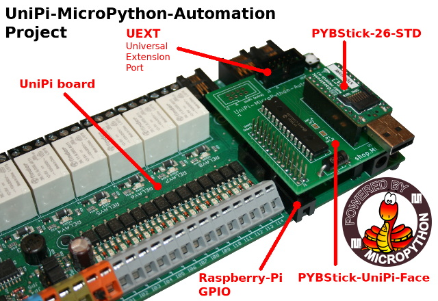
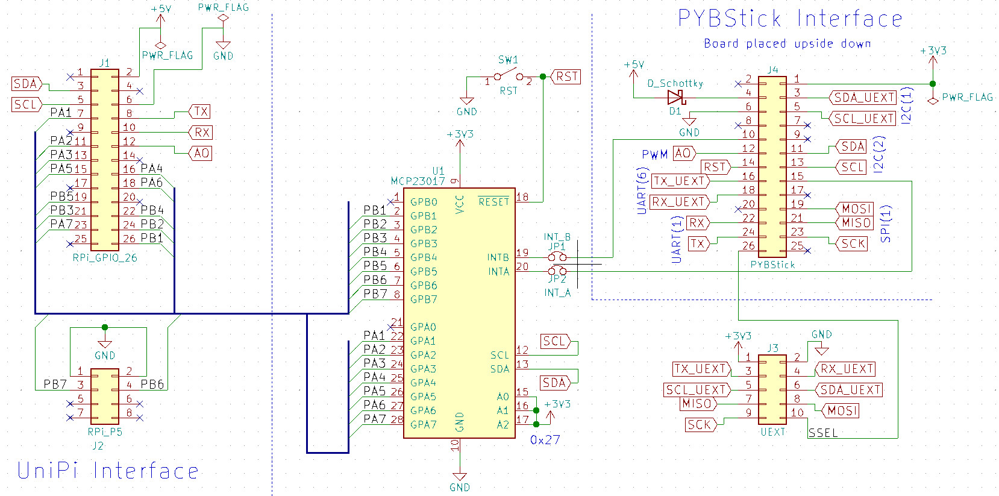
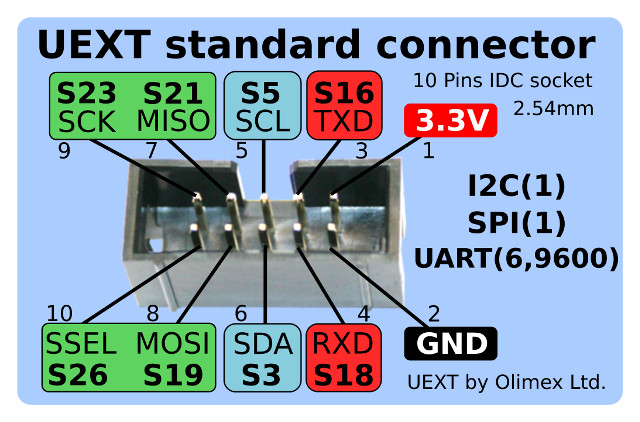

[This ReadMe also exists in ENGLISH](readme_ENG.md)

# UniPi-MicroPython-Automation: Utiliser une carte UniPi Pour réaliser une automate programmable sous MicroPython

Réaliser un automate programmable MicroPython c'est une beau projet par contre, une interface automation, cela ne se conçoit pas à la légère. Cela tombe bien, la société [UniPi Technologie à créé l'UniPi V1.1](https://shop.mchobby.be/product.php?id_product=1171), une carte de qualité professionnelle prévue pour Raspberry-Pi.

Pourquoi ne pas envisager l'utilisation d'un microcontrôleur sous MicroPython? Nous aurions là le __premier Automate fonctionnant sous Python__!

Le projet __UniPi-MicroPython-Automation__ est né.


* __8 × relais :__ deux directions (250V alternatif/5A -ou- 24V continu/5A)
* __14 × entrées digitales :__ pour lire les signaux provenant de périphériques externes. Avec isolation galvanique par opto-coupleur. Déclenchement entre 5 et 24V continu. 12 entrées + 2 entrées.
* __2 × entrée analogique :__ pour lire le signal analogique de périphériques externes. Entre 0-10 V continu.
* __1 × sortie analogique :__ pour réaliser une sortie de contrôle proportionnel. Entre 0-10 V continu.
* __1 × port 1-Wire :__ (RJ45) pour connecter des périphériques 1-Wire comme sonde de température, senseur d'humidité.
* __1 × port I2C :__ (RJ11) pour de connecter des modules d'extension comme des relais, entrée analogique, sortie digitale.
* __1 × port UART :__ (RJ11) pour connecter un périphérique série (lecteur NFC, lecteur code-barre) ou un câble console série.
* __1 × Horloge temps réel :__ avec boîtier pour la pile (aussi appelée RTC pour Real Time Clock)
* __1 x breakout I2C :__ sur la carte. pour y connecter vos propres extensions I2C.
* __1 x sortie 12v :__ alimentation 12v 200mA à utiliser avec les entrée digitales de l'UniPi.

## Carte PYBStick-UniPi-Face
La carte [PYBStick-UniPi-Face](https://shop.mchobby.be/product.php?id_product=1891) permet d'interfacer une carte [PYbStick Standard](https://shop.mchobby.be/product.php?id_product=1844) ou [PYbStick PRO](https://shop.mchobby.be/product.php?id_product=1844) sur la carte UniPi V1.1 (ou UniPi Lite).



Le connecteur J2 dois aussi être branché (avec des connecteurs Dupont) pour pouvoir utiliser les entrées I13 & I14.


Le schéma de la carte d'interface est le suivant:



Certaines broches GPIO de la PYBStick sont encore disponibles:
* __S7__ libre mais aussi la broche Boot0 (doit etre au niveau haut au démarrage).
* __S10 & S15__ sauf si vous avez ponter les cavalier d'interruption du MCP23017.
* __S3 & S5__ sauf si vous utilisez le bus I2C sur connecteur UEXT.
* __S16 & S18__ sauf si vous utilisez l'UART sur le connecteur UEXT.
* __S19, S21, S23, S26__ sauf si vous utilisez le bus SPI sur le connecteur UEXT.

De nombreux signaux du PYBStick arrivent sur le connecteur UEXT. Si vous n'employez pas ce connecteur avec d'autres interfaces alors vous pouvez facilement récupérer les signaux de la PYBStick sur celui-ci.




# Installer
Il est nécessaire de copier les bibliothèques suivantes sur la carte MicroPython avant de pouvoir utiliser la carte UniPiFace + UniPi.

* `unipi.py` : bibliothèque principale pour accéder à la carte UniPi
* `ds2482.py` : 1Wire bus master (still under development)
* `mcp342x.py` : ADC conversion
* `mcp2300xx.py` : GPIO extender
* `mcp24Cxx.py` : EEPROM access
# Tester

## Sorties relais

Les sorties numériques se présentes sous forme de 8 relais commandables individuellement.

Chaque relais est capable de commuter un courant de 5A sous 250V AC (ou 5A sous 24V Continu). Ces relais sont dit SPDT _Single Pole Double Throw_ (Simple phase, deux directions) et propose donc un contact normalement ouvert et un contact normalement ferme (lorsque le relais est au repos). Le contact Normalement ouvert, noté NO, est le plus couramment utilisé.


L'utilisation des relais est très simple.

```
from unipi import unipi
import time

# Activer des relais
unipi.relays[1] = True
unipi.relays[3] = True
unipi.relays[8] = True
time.sleep( 1 )

# Désactiver un relais
unipi.relays[3] = False

# Affiche l'état des relais
for i in range(1, 9): # de 1 à 8
	print( "relais %s = %s" % (i, unipi.relays[i]) )
```

## Entrées numériques

UniPi dispose de 14 entrées numériques avec opto-coupleur. Cela permet d'utiliser ces entrées avec une tension d'alimentation entre 12 et 24V (standard dans l'industrie).

Pour facilite l'utilisation de l'UniPi, une alimentation 12V est également disponible sur la carte et peut être utilisé pour activer une entrée numérique.

Le schéma ci-dessous couvre les deux cas de figures en montrant comment utiliser l'alimentation interne 12V ou une alimentation externe 24V.


```
from unipi import unipi

# Acquisition de l'état des 14 entrées
unipi.inputs.read()

# Afficher l'état des entrées 1 et 3
print( "IN1 = %s" % unipi.inputs[1] )
print( "IN3 = %s" % unipi.inputs[3] )

# Affichage de l'état de toutes les entrées
for i in range(1, 15): # 1 à 14
	print( "IN%s = %s" % (i, unipi.inputs[i]) )
```

La fonction `read()` permet d'interroger l'état de toutes les entrées de la carte UniPi en une seule opération sur le bus I2C (un peu comme un instantané). Cela permet de diminuer le trafic sur le bus qui desservant aussi les autres périphériques de la carte __mais impose un appel à `read()` à chaque fois que l'on veut relever l'état des entrées__.

L'exemple suivant fait un relevé des entrées et affiche le contenu sous forme d'un dictionnaire.

```
from unipi import unipi

# Acquisition de l'état des 14 entrées
unipi.inputs.read()
print( unipi.inputs.read_all() )
```
Ce qui produit un résultat comme celui-ci

```
{1: False, 2: False, 3: False, 4: False, 5: False, 6: False, 7: False, 8: False, 9: False, 10: False, 11: False, 12: False, 13: False, 14: False}
```

A noter que `read_all()` accepte le paramètre complémentaire `read=True` qui effectue une lectures des entrées de la carte avant de composer le dictionnaire.

L'exemple suivant exploite cette caractéristique pour afficher, en continu, l'état des entrées.

```
from unipi import unipi
import time

counter = 0
while True:
	print( "Iter %4i -> %r" % (counter, unipi.inputs.read_all(read=True)) )
	counter += 1
	time.sleep(1)
```

## Entrées Analogiques

UniPi expose deux entrée analogiques libellées AI1+ et AI2+ permettant de relever une tension continue entre et __10V maximum__.

La tension d'entrée est mesurée entre AI1- et AI1+, sachant que AI1- est connecté sur la masse commune de la carte (GND). C'est également le cas pour la sortie AI2-.

Le schéma de raccordement ci-dessous utilise un potentiomètre pour fixer la tension analogique, entre 0 et 10V, sur l'entrée AI2+.


Le script permettant de lire la tension analogique est simple

```
from unipi import unipi
import time

# Lecture de tension analogique entre 0 et 10V
print( "--- Lire les entrées AI1+ et AI2+ ---")
print( "ADC 1 = %s Volts" % unipi.adcs[1] )
print( "ADC 2 = %s Volts" % unipi.adcs[2] )

print( "--- Lecture en continu ---")
while True:
	print( "ADC 1 : %4.2f v | ADC 2 : %4.2f v" % (unipi.adcs[1],unipi.adcs[2]) )
	time.sleep(1)
```

## Sortie Analogique

L'UniPi dispose d'une sortie Analogique libellée A0.

Cette sortie analogique est alimentée par un régulateur de tension indépendant (broches AOG et AOV avec respectivement la masse et tension d'alimentation du régulateur, 35V Max).

La tension de MAX de sortie de la sortie analogique est fixée à l'aide du potentiomètre (préconfiguré sur 10 Volts).


Il faut donc fournir une tension d'alimentation au circuit de la sortie analogique. Cela peut se faire à partir de l'alimentation 12V de l'UniPi ou une alimentation externe.


La tension de sortie est commandée entre 0 et 100% à l'aide du cycle utile d'un signal PWM.

La gestion du signal PWM est totalement transparent et pris en charge par la bibliothèque MicroPython.

```
from unipi import unipi

# AOUT (AO)
print( "--- Fixer la tension à 33% of Max AO ---")
unipi.analog_out =33 # 33% de 10V = 3.3V
```

# Fonctionnalités avancées

La carte UniPi dispose de périphériques complémentaires offrant des fonctionnalités avancées.

## Connecteur UEXT

Le connecteur [UEXT (Universal EXTension)](https://en.wikipedia.org/wiki/UEXT) présent sur la carte d'extension transporte les bus I2C, SPI, UART et une alimentation 3.3V.

La bibliothèque `unipi` permet de créer facilement les instances des bus I2C, SPI et UART disponible sur le port UEXT.

```
from unipi import unipi
i2c = unipi.uext.i2c( freq=10000 )
spi = unipi.uext.spi( baudrate=1000000, polarity=0, phase=0 )
uart = unipi.uext.uart( 9600, bits=8, parity=None, stop=1 )
```

Très simple à mettre en oeuvre, le standard ouvert UEXT permet d'utiliser très facilement [des modules UEXT existants](https://www.olimex.com/Products/Modules/) (également [disponible chez MCHobby](https://shop.mchobby.be/fr/138-uext)). De par sa simplicité, il est facile de créer ses propres interfaces. L'intérêt d'UEXT est d'être très résistant.

L'exemple ci-dessous reprend l'utilisation d'un [module UEXT modtc-mk2](https://shop.mchobby.be/fr/uext/1624-mod-tc-mk2-31855-interface-thermocouple-type-k-avec-max31855-bus-i2c-gpio-3232100016248-olimex.html), un module thermocouple via I2C dont le [pilote MicroPython est disponible ici sur le dépôt esp8266-upy](https://github.com/mchobby/esp8266-upy/tree/master/modtc-mk2).


Le pilote `modtc_mk2.py` (voir ci-dessus) doit bien entendu être copié sur la carte MicroPython pour pouvoir exécuter l'exemple suivant.

```
from unipi import unipi
from modtc_mk2 import MODTC_MK2

# Obtenir un instance du bus I2C sur le connecteur UEXT
# Retourne une référence machine.I2C
i2c = unipi.uext.i2c( freq=10000 ) # accepte des paramètres complémentaires
mk2 = MODTC_MK2( i2c )

temp_in, temp_ext = mk2.temperatures
print( "Internal Temp = %s" % temp_in )
print( "External Temp = %s" % temp_ext )
```

## EEPROM

L'EEPROM de 256 octets présent sur la carte UniPi contient différentes informations.

Parmi ces informations, il y a les coefficients précis concernant les entrées analogiques. Ces coefficients sont automatiquement utilisés par la bibliothèque UniPi.

```
from unipi import unipi
import time

print( "UniPi board version : %s" % unipi.eeprom.board_version )
print( "AI1,AI2 coef = %f, %f" % unipi.eeprom.analog_input_coefs )
```

Ce qui affiche le résultat suivant:

```
UniPi board version : 1.1
AI1,AI2 coef = 5.570117, 5.570414
```

La méthode `unipi.eeprom.dump()` affiche le contenu de l'EEPROM dans sa totalité.

```
0x0 : FF FF FF FF FF FF FF FF : ........
0x8 : FF FF FF FF FF FF FF FF : ........
0x10 : FF FF FF FF FF FF FF FF : ........
...
0xd0 : FF FF FF FF FF FF FF FF : ........
0xd8 : FF FF FF FF FF FF FF FF : ........
0xe0 : FA 55 01 01 3C 1C 00 00 : .U..<...
0xe8 : 02 FD 00 00 00 00 00 00 : ........
0xf0 : 40 B2 3E 67 40 B2 40 D5 : @.>g@.@.
0xf8 : 00 00 00 00 00 00 00 00 : ........
```

# Ressources
* [UniPi-Board.png](docs/UniPi-Board.png) : Image de la carte UniPi V1.1 vue du dessus
* [UniPi-terminals.png](docs/UniPi-terminals.png) : Image du bornier d'entrée UniPi V1.1 (gros plan)

# Licence
Les bibliothèques et code d'examples UniPi pour MicroPython sont sous licence GPLv3
The UniPi libraries and examples for MicroPython are released under GPLv3

Copyright (C) 2020  - Meurisse D. (shop.mchobby.be)

This program is free software: you can redistribute it and/or modify
it under the terms of the GNU General Public License as published by
the Free Software Foundation, either version 3 of the License, or
(at your option) any later version.

This program is distributed in the hope that it will be useful,
but WITHOUT ANY WARRANTY; without even the implied warranty of
MERCHANTABILITY or FITNESS FOR A PARTICULAR PURPOSE.  See the
GNU General Public License for more details.

You should have received a copy of the GNU General Public License
along with this program.  If not, see <https://www.gnu.org/licenses/>

# Où acheter
* [PYbStick STD](https://shop.mchobby.be/product.php?id_product=1844) ou [PYbStick PRO](https://shop.mchobby.be/product.php?id_product=1844)  @ MCHobby
* [Carte d'interface PYBStick-UniPi-Face (UniPi-Face)](https://shop.mchobby.be/product.php?id_product=1891) @ MCHobby
* [Carte d'interface GRL-Pyboard-UniPi](https://shop.mchobby.be/product.php?id_product=2055) @ MCHobby)
* [Carte UniPi](https://shop.mchobby.be/product.php?id_product=1171) @ MCHobby
* [Carte UniPi Lite](https://shop.mchobby.be/product.php?id_product=1196) @ MCHobby
* [Cartes MicroPython Pyboard](https://shop.mchobby.be/fr/56-micropython) @ MCHobby
